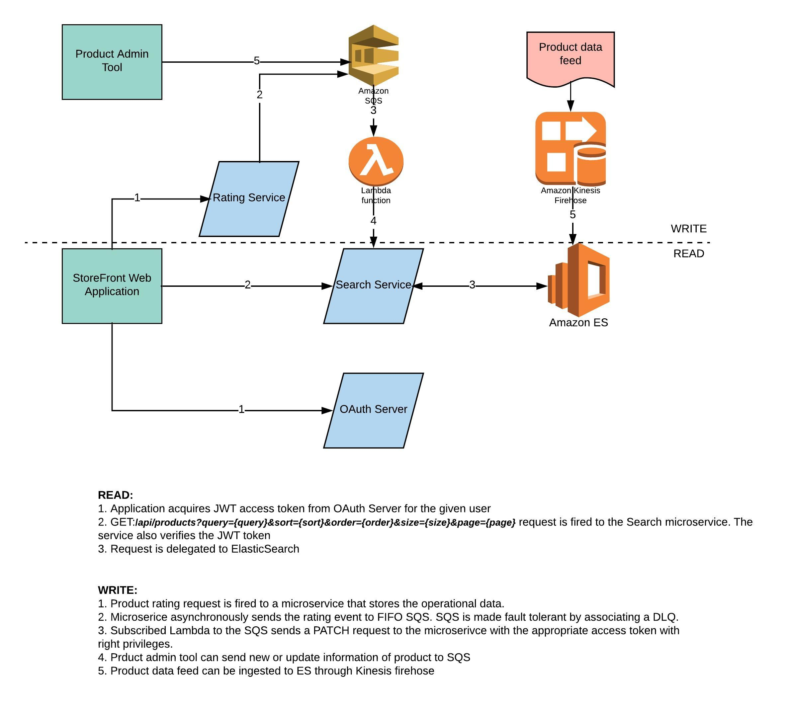

# Product Search Service

### Technology Stack
1. Java 12
2. Spring Boot 2.1
3. Embedded Tomcat
4. Elastic Search 6.5.4
5. Docker

### Build

Build tool: Gradle

Build: `./gradlew clean build`

### Instruction for local setup

Two containers are required with the application image and ElasticSearch image.

Following command will start the containers:

`docker-compose up --build`

Initialize the ES with the sample data set:

```
curl -XPOST 'http://localhost:8080/api/products/' -H 'Content-Type: application/json' -d '
   [{"id":10011646,"name":"Linksys EtherFast EZXS88W Ethernet Switch - EZXS88W","description":"Linksys EtherFast 8-Port 10/100 Switch (New/Workgroup)","manufacturer":"LINKSYS","price":99.99},
   {"id":10140760,"name":"Linksys EtherFast EZXS55W Ethernet Switch","description":"5 x 10/100Base-TX LAN","manufacturer":"LINKSYS","price":89.99},
   {"id":10221960,"name":"Netgear ProSafe FS105 Ethernet Switch - FS105NA","description":"NETGEAR FS105 Prosafe 5 Port 10/100 Desktop Switch","manufacturer":"Netgear","price":129.99},
   {"id":10246269,"name":"Belkin Pro Series High Integrity VGA/SVGA Monitor Extension Cable - F3H982-10","description":"1 x HD-15 - 1 x HD-15 - 10ft - Beige","manufacturer":"Belkin","price":399.99},
   {"id":10315184,"name":"Netgear ProSafe JFS516 Ethernet Switch","description":"Netgear ProSafe 16 Port 10/100 Rackmount Switch- JFS516NA","manufacturer":"Netgear","price":799.99},
   {"id":10316920,"name":"LaCie Pocket Floppy Disk Drive - 706018","description":"LaCie Pocket USB Floppy 1.44 MB","manufacturer":"LACIE","price":9.99},
   {"id":10333368,"name":"Kensington Orbit Optical Trackball - USB w/PS2 Adapter - 64327","description":"Optical - USB, PS/2","manufacturer":"Kensington","price":9.99},
   {"id":10333846,"name":"Linksys EtherFast EF4116 Ethernet Switch","description":"16 x 10/100Base-TX LAN","manufacturer":"LINKSYS","price":99.99},
   {"id":10343605,"name":"Linksys Instant Gigabit EG005W Ethernet Switch","description":"Linksys EG005W Gigabit 5-Port Workgroup Switch","manufacturer":"LINKSYS","price":301.00},
   {"id":10346525,"name":"Linksys G Wireless-G WET54G Wireless Bridge","description":"54Mbps - 1 x 10/100Base-TX","manufacturer":"LINKSYS","price":0.99},
   {"id":10351869,"name":"Tripp Lite PowerVerter 375-Watt Ultra-Compact Inverter - PV375","description":"Input Voltage:12V DC - Output Voltage:120V AC - 375W Pulse-width Modulated Sine Wave","manufacturer":"Tripp Lite","price":40.00}]'

```

### Supported HTTP methods

#### GET 

Get by product `id` or `query`

Example:
```
curl -XGET 'http://localhost:8080/api/products?search=manufacturer:netgear&sort=price&order=asc&size=10&page=0'`

curl -XGET 'http://localhost:8080/api/products?size=10&page=0'

curl -XGET 'http://localhost:8080/api/products/10351869'
```

#### POST

Example:
```
curl -XPOST 'http://localhost:8080/api/products/' -H 'Content-Type: application/json' -d '
[{"id":10011646,"name":"Linksys EtherFast EZXS88W Ethernet Switch - EZXS88W","description":"Linksys EtherFast 8-Port 10/100 Switch (New/Workgroup)","manufacturer":"LINKSYS","price":99.99}]'
```
#### PATCH

Example:
```
curl -XPATCH 'http://localhost:8080/api/products/10351869' -H 'Content-Type: application/json' -d '{"price":41.99}'
```
#### DELETE
Example:
```
curl -XDELETE 'http://localhost:8080/api/products/10351869'
```

## Architecture

